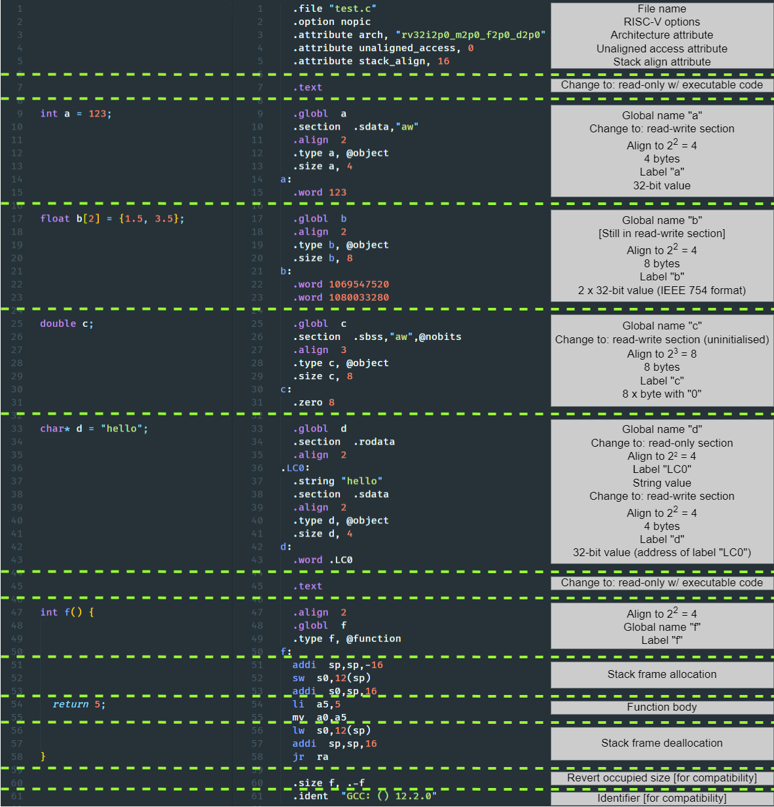

Assembler directives
====================
"The assembler implements a number of directives that control the assembly of instructions into an object file. These directives give the ability to include arbitrary data in the object file, control exporting of symbols, selection of sections, alignment of data, assembly options for compression, position dependent and position independent code" - quote from [RISC-V Assembler Reference](https://michaeljclark.github.io/asm.html).

The linked guide explains in details all available directives, but fortunately you only need a very small subset to start with and even the more advanced features only require a few additional directives. While [Godbolt](https://godbolt.org/z/vMMnWbsff) emits some directives, to see all of them (more than you actually need) you are advised to run:

```riscv64-unknown-elf-gcc -std=c90 -pedantic -ansi -O0 -march=rv32imfd -mabi=ilp32d -S [source-file.c] -o [dest-file.s]```.

In the [`scripts/test.py`](../scripts/test.py) script, when running testcases, there is the aforementioned call to the compiler and the compiled test programs can be found as `<test_name>.gcc.s`. Your compiler may not produce the exact same assembly as GCC, so it is not advisable to blindly attempt to replicate the GCC output. Instead, the purpose of the `.gcc.s` files is to assist in debugging issues within your own compiler.

The below picture offers a quick walk-through of a very simple program with detailed annotations describing the meaning behind the included directives. Some of them a crucial (e.g. section specifiers, labels, data emitting) while others not so much (e.g. file attributes, compiler identifier, symbol types) - you will get a feel for them during the development of the compiler. Most importantly, you only need to set the correct section and provide function directives as long as you deal with local variables. **In other words, you can postpone studying this document in details until you decide to deal with global variables.**


